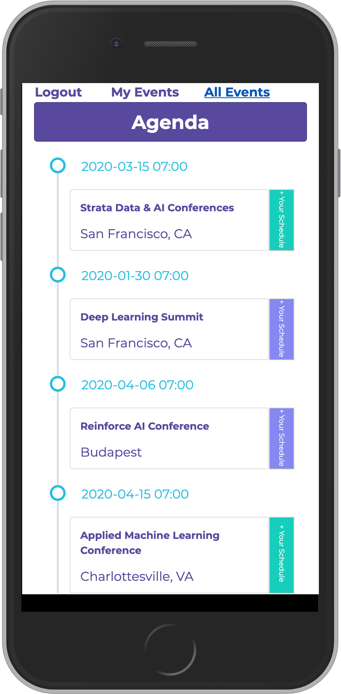

<p>
  <h1 align="center">Rails API, React & Redux - Event Scheduler</h1>
</p>
<br>
<p align="center">
  <a href="https://www.ruby-lang.org/en/">
    
  </a>
  <a href="http://rubyonrails.org/">
    
  </a>
</p>

This project consist of building a mobile web app for an Events Scheduler using Rails API as backend, and ReactJS as frontend. 



In this project, we will build a Web App with the following technologies:
- API
  - Ruby on Rails
  - PostgreSQL

- Frontend (Inside /client folder)
  - React
  - Redux

## Technologies used

- Ruby on Rails
- RSpec
- PostgreSQL
- Apollo Client
- GraphQL
- Git
- Bootstrap
- HTML & CSS
- ReactJS
- Heroku

## Live Version
[Events Scheduler Web App](https://rocky-reef-66767.herokuapp.com)

## Prerequisites

- [Ruby](https://www.ruby-lang.org/en/): we recommend using
  [rbenv](https://github.com/rbenv/rbenv) to install the Ruby version listed on
  the badge.
- [Yarn](https://yarnpkg.com/): please refer to their
  [installation guide](https://yarnpkg.com/en/docs/install).
- [PostgreSQL](https://www.postgresql.org/) 11.5 or higher.

## Installation
- To get started with the app, first clone the repo and `cd` into the directory:
  
  ```
  $ git clone https://github.com/AndresFMoya/react-rails_event_scheduler.git
  $ cd react-rails_event_scheduler
  ```
- You need to install the gems:
   - You may need to first run `bundle install` if you have older gems in your environment from previous Rails work. If you get an error message like `Your Ruby version is 2.x.x, but your Gemfile specified 2.4.4` then you need to install the ruby version 2.6.4 using `rvm` or `rbenv`.
     - Using **rvm**: `rvm install 2.6.4` followed by `rvm use 2.6.4`
     - Using **rbenv**: `rbenv install 2.6.4` followed by `rbenv local 2.6.4`
   - Install gems with `bundle install --without production` from the rails root folder, to install the gems you'll need, excluding those needed only in production.
- Run `rails db:create` followed by `rails db:migrate` to set up the database
- Install static assets (like external javascript libraries, fonts) with `yarn install`    
- To launch the app locally run: `heroku local -f Procfile.dev`.

## 🤝 Contributing

Contributions, issues and feature requests are welcome! Feel free to check [issues page](https://github.com/AndresFMoya/react-rails_event_scheduler/issues).

1. Fork it (https://github.com/AndresFMoya/react-rails_event_scheduler/fork)
2. Create your working branch (git checkout -b [choose-a-name])
3. Commit your changes (git commit -am 'what this commit will fix/add/improve')
4. Push to the branch (git push origin [chosen-name])
5. Create a new pull request


## Contributors

Andrés Moya - [GitHub](https://github.com/andresfmoya)

## Show your support

Give a ⭐️ if you like this project!

## License

This project is [MIT](https://github.com/AndresFMoya/react-rails_event_scheduler/blob/develop/LICENSE) licensed.

## Contact
- **Andrés Moya** - [@andresfmoya](https://github.com/andresfmoya) I will love to hear about you at one of the following places! :heart:

- [LinkedIn](https://www.linkedin.com/in/andres-f-moya/)
- [Twitter](https://www.twitter.com/andmedev/) 
- <andresfmoya@gmail.com>.